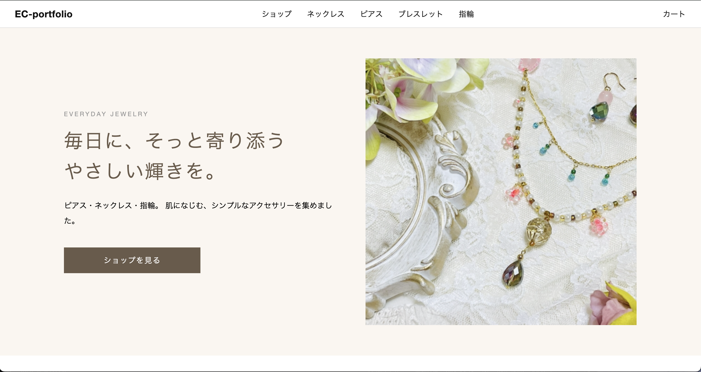
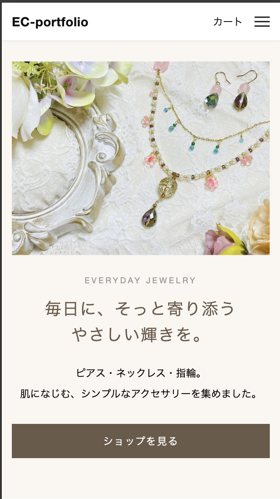
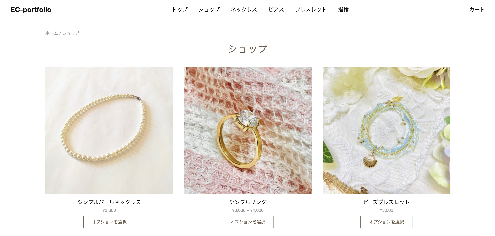
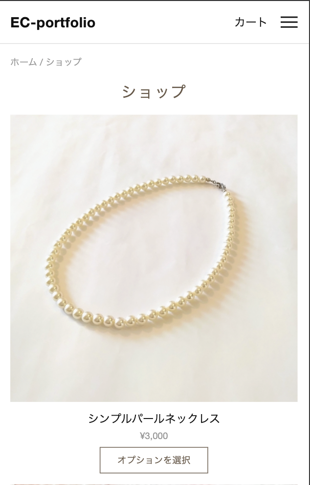
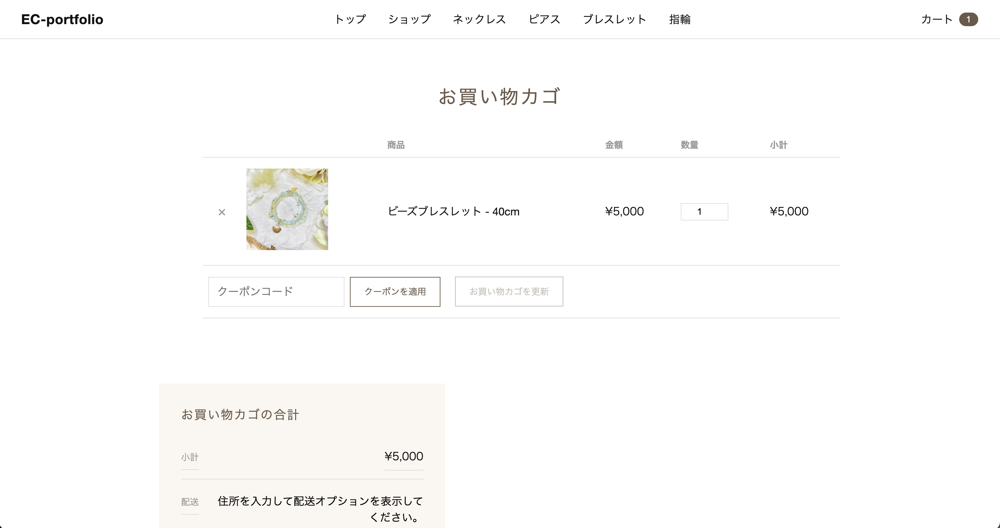
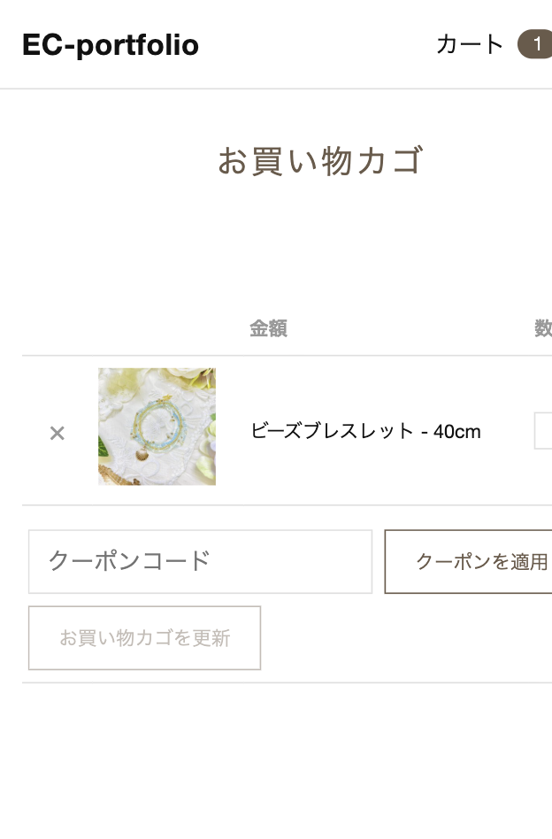

# EC-portfolio

ハンドメイドアクセサリーを扱う架空のECサイトです。WordPress + WooCommerce のオリジナルテーマを一から制作しました。
トップページから、商品一覧・商品詳細・カート・決済・注文完了・マイアカウントまで、購入の流れに関わる画面をすべてデザイン・実装しています。

- デモサイト: https://coda-webcraft.github.io/ec-portfolio/(※画面デザイン確認用の静的サイトです。カート追加・決済など動的な操作は行えません)
- 制作期間: 2026年9月


| PC | スマホ |
| --- | --- |
|  |  |
|  |  |
|  |  |

---

## 制作の目的

案件獲得のためのポートフォリオとして、次の3点を示すことを目的にしています。

1. WooCommerce の標準テンプレートに頼らず、テーマ側で全画面を統一したデザインに仕上げられること
2. PC とスマホの両方で、迷わず購入まで進める UI を設計できること
3. Sass による保守しやすい CSS 設計ができること

## デザインのコンセプト

自然な ベージュ / ブラウン を基調に、アクセサリーの写真が主役になる落ち着いた見た目にしました。
装飾を抑え、余白・文字間・線の細さで上品さを出しています。

## 使用技術

| 分類 | 内容 |
| --- | --- |
| CMS | WordPress（オリジナルテーマ） |
| EC | WooCommerce |
| 決済 | Stripe（テストモード） |
| CSS | Sass（SCSS）、パーシャル分割 |
| JavaScript | Vanilla JS（ハンバーガーメニュー） |
| 開発環境 | Local |
| バージョン管理 | Git / GitHub |

## 実装した画面

- トップページ（ヒーロー、新着アイテム、ストーリー紹介など）
- ショップ一覧 / カテゴリー別一覧
- 商品詳細（バリエーション選択に対応）
- カート
- チェックアウト
- 注文完了ページ
- マイアカウント（注文履歴 / 注文詳細 / 住所 / アカウント詳細 / ログイン）
- 404 ページ
- ヘッダー（ハンバーガーメニュー対応）/ フッター

## 工夫した点

### 1. WooCommerce の全画面をテーマ側で統一
WooCommerce の標準スタイルに頼らず、カート・チェックアウト・注文完了・マイアカウントまで、サイト全体のトーンに合わせて設計しました。
購入の途中で見た目が変わってしまうことがなく、一貫した体験になっています。

### 2. スマホでの操作性を重視
- ヘッダーはスマホ幅でハンバーガーメニューに切り替え（ボタンの開閉状態は `aria-expanded` で管理し、Esc キーでも閉じられます）
- カートは、テーブルが画面より広くなってもページ全体が拡大表示されないよう、表の中だけを横スクロールにしました
- 入力欄やボタンは指で押しやすい高さ（44px 以上）に統一しました

### 3. 購入の流れを止めないための細かな調整
- クーポンのエラー文は、入力欄の下に1行で表示して、レイアウトが崩れないようにしました
- 注文完了ページから「買い物を続ける」へ戻れる導線を用意しました
- ヘッダーに常にカートへのリンクと点数バッジを表示します
- トップページ以外では、ナビゲーションの先頭に「トップ」を自動で追加します

### 4. Sass による CSS 設計
- 色・余白・フォントサイズを変数化し、`foundation` / `layout` / `woocommerce` に分けて管理しました
- 画面ごとに `.woocommerce-cart` などの body クラスでスコープを分け、他の画面へスタイルが影響しないようにしました
- ブレークポイントは1つ（768px）に絞り、メディアクエリは各ファイルの末尾にまとめました

### 5. アクセシビリティ
- ハンバーガーボタンに `aria-label` / `aria-expanded` / `aria-controls` を設定しました
- フォーカス時のアウトラインを消さず、キーボード操作でも状態がわかるようにしました
- リンクと本文の色は、背景とのコントラストを確認して決めています

## ディレクトリ構成（抜粋）

```
ec-portfolio-theme/
├── docs/                    # GitHub Pages公開用（静的サイト）
│   └── screenshots/         # README用スクリーンショット
├── assets/
│   └── js/nav.js            # ハンバーガーメニュー
├── scss/
│   ├── style.scss
│   ├── foundation/          # 変数・リセットなど
│   ├── layout/               # ヘッダー・フッター・404 など
│   └── woocommerce/          # 商品・カート・チェックアウト・注文完了・マイアカウント
├── woocommerce/              # WooCommerce標準テンプレートの上書き
├── 404.php
├── footer.php
├── front-page.php            # トップページ
├── functions.php
├── header.php
├── index.php
├── page.php
└── style.css                 # Sass から書き出し
```

## セットアップ

```bash
# 1. WordPress を用意し、WooCommerce を有効化する
# 2. このリポジトリを wp-content/themes/ 配下に置く
# 3. 管理画面で「EC-portfolio」テーマを有効化する
# 4. Sass をコンパイルする（テーマのフォルダで実行）
sass --watch scss/style.scss:style.css
```

- 決済は Stripe のテストモードです。テストカード番号 `4242 4242 4242 4242` で動作確認できます。
- 表示している商品・住所・注文データは、すべて動作確認用のダミーです。

## 今後の改善予定

- 検索結果ページのデザイン
- 商品ページの関連商品・パンくずリスト
- 画像の最適化（WebP 化・遅延読み込み）
- 特定商取引法に基づく表記・プライバシーポリシーページの追加

## 制作者

**coda.**（フリーランス Web 制作）

- GitHub: [@coda-webcraft](https://github.com/coda-webcraft)
- Contact: coda.webcraft@gmail.com
- 制作環境: Local（ローカル開発環境）
